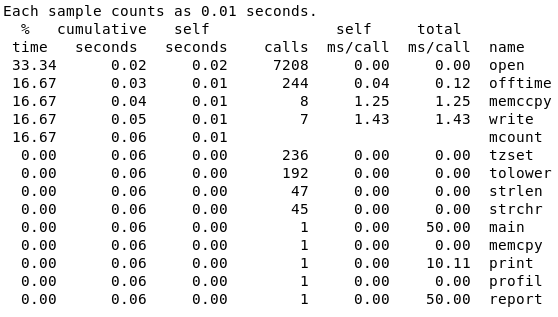
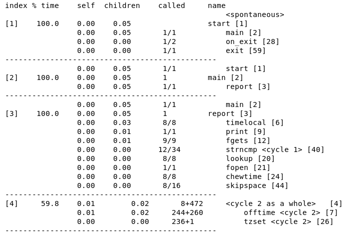
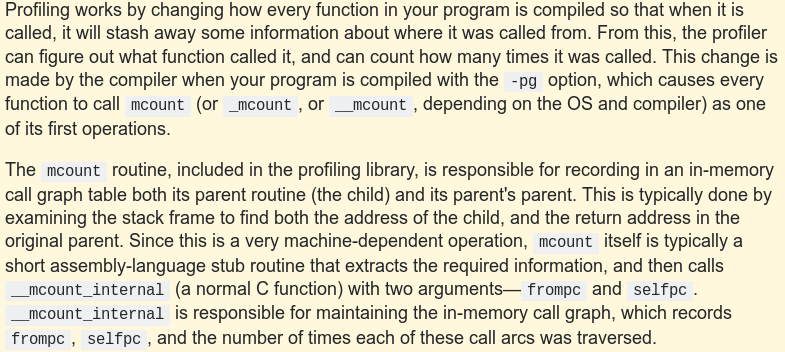
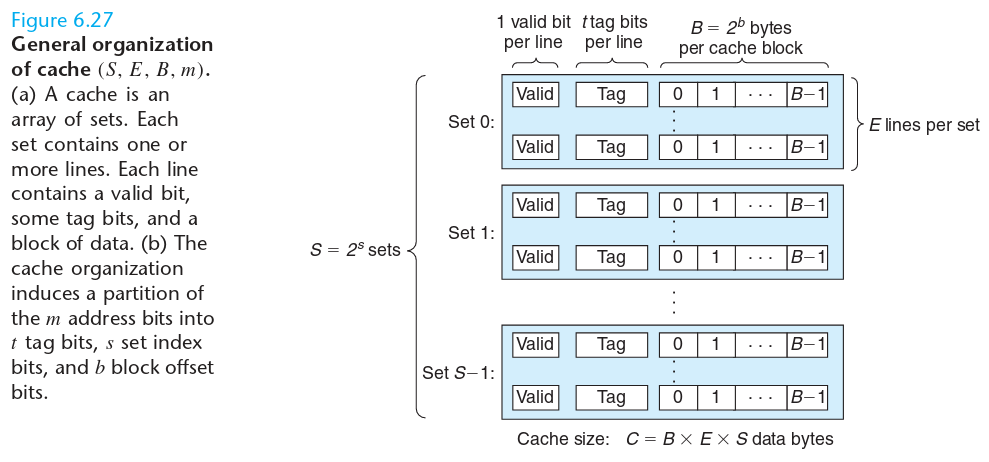
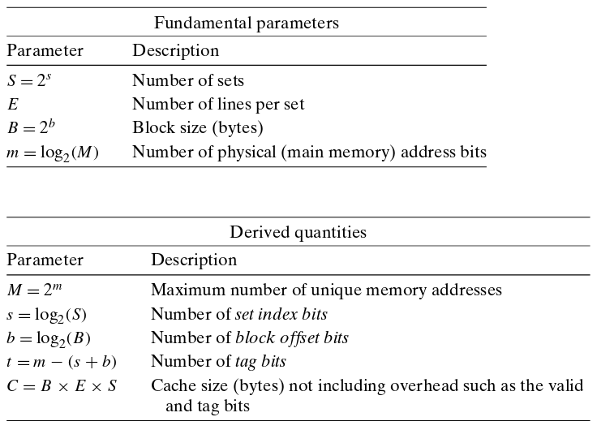
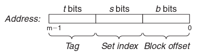
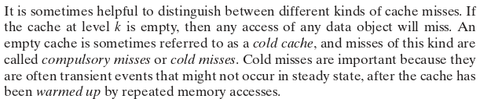
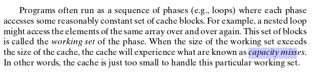
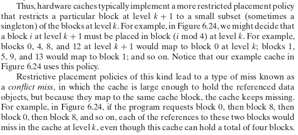

# Zadanie 1
#### Myśli z cytatu:
- Nie optymalizuje się ważnych części programu
- Pogorszone utrzymanie i debugowanie, gdy optymalizuje się mało znaczące elementy
- Przedwczesna optymalizacja źródłem wszelkiego zła

> Do czego służą programy profilujące?

Badają ile czasu program spędza w konkretnych miejscach w kodzie.

> Czym różni się profil płaski od profilu grafu wywołań?

- Płaski informuje ile czasu spędziliśmy w danej funkcji i ile razy została wywołana

- Graf wywołań: dodatkowo podaje informacje dla każdej funkcji ile czasu zajęło wykonanie jej instrukcji, a ile na inne funkcje wywoływane przez nią

> Czemu profilowanie programu wymaga zbudowania go ze specjalną opcją kompilatora -pg?

Gdyż tylko wtedy możliwe jest zliczanie czasu. Każda funkcja zostaje udekorowana tak, że zostawia informacje skąd została wywołana. Na podstawie tego można liczyć. 

[Source](http://stackoverflow.com/questions/7290131/how-does-gccs-pg-flag-work)

# Zadanie 2

- Szerokość szyn adresowej: 12 bitów
- 4 zbiory(pic) = S = 2^s => s = 2
- 2 bloki/zbiór
- 4 bajty/blok  = B = 2^b => b = 2

> Które bity adresu wyznaczają: tag, indeks, offset?

### Adres słowa: | t=? | s=2 | b=2 | bitów; t = 12 - 4 = 8
Z obrazka: na tag mamy 8bitów, 12bitów na całość

| indeks | Znacznik | Valid | B0 | B1 | B2 | B3 |
| ------ | -------- | ----- | -- | -- | -- | -- |
| 0      | 00       | 1     | 40 | 41 | 42 | 43 |
|        | 83       | 1     | FE | 97 | CC | D0 |
| 1      | 00       | 1     | 44 | 45 | 46 | 47 |
|        | 83       | 0     | –  | –  | –  | –  |
| 2      | 00       | 1     | 48 | 49 | 4A | 4B |
|        | 40       | 0     | –  | –  | –  | –  |
| 3      | FF       | 1     | 9A | C0 | 03 | FF |
|        | 00       | 0     | –  | –  | –  | –  |

> Określ, które z poniższych operacji odczytu wygenerują trafienie i ew. jakie wartości wczytają:

             tag    index   offset
    0x832 = 0x830 + 0b00  + 0b10  => hit; B2 B3
    0x835 = 0x830 + 0b01  + 0b01  => miss (not valid)
    0xFFD = 0xFF0 + 0b11  + 0b01  => hit; B1 B2

# Zadanie 3
rozmiar(tag, index, offset): (22, 5, 5).  
korzystamy z tabelki z poprzedniego zadania:  
- s = index = 5 = log_2(S) => liczba zbiorów (S) = 2^5 = 32, a więc linii też.  
- b = offset = 5 = log_2(B) => Rozmiar bloku (B) = 2^5 B  

metadane = 32 linii * (22 bitów tagu + 1 bit valid) = 736 b  
dane = 32 linii * 32 Bajtów = 8192 b
stosunek = 8192/736 =~ 11.13  

# Zadanie 4
>compulsory miss  

>capacity miss  

>conflict miss  

>0 4 16 132 232 160 1024 28 140 3100 180 2180

0, 100, 1000, 100 00100, 111 01000, 101 00000, 1 00000 00000,
11100, 100 01100, 11 00000 11100, 101 10100, 10 00100 00100
>(tag, index, offset)

- (0, 0, 0) compulsory miss (valid = 0)
- **(0, 0, 100) hit!**
- **(0, 0, 1000) hit!**
- (0, 100, 00100) compulsory miss
- (0, 111, 01000) compulsory miss
- (0, 101 00000) compulsory miss
- (1, 0, 0) miss (tagi nie pasują, capacity?)
- (0, 0, 11100) conflict miss (bo byl wczesniej, ale musielismy go nadpisac mimo, że miejsca dużo)
- **(0, 100, 01100) hit!**
- (11, 0, 11100) miss (capacity?)
- **(0, 101, 10100) hit!**
- (10, 100, 00100) miss (capacity?)

na końcu:  
(0, 111, ...) (0,101, ...)  
(11, 0, ...) (10, 100, ...)  

Efektywność = 4/12 = 33.(3)%
Ile zastąpionych = 4