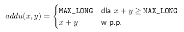
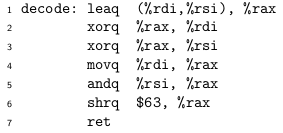

# ASK: Lista 4

co oznaczają literki po instrukcjach (np. addq zamiast add):  


## Zadanie 1
Poniżej podano wartości typu long leżące pod wskazanymi adresami i w rejestrach:

| Adres | Wartość | Rejestr | Wartość |
| ----- | :-----: | ------- | :-----: |
| 0x100 | 0xFF    | %rax    | 0x100   |
| 0x108 | 0xAB    | %rcx    | 1       |
| 0x110 | 0x13    | %rdx    | 3       |
| 0x118 | 0x11    |


Oblicz wartość poniższych operandów:

1. %rax  
 `R[%rax] => 0x100`
2. 0x110  
 `M[0x110] => 0x13`
3. $0x108  
 `0x108`
4. (%rax)  
 `M[R[%rax]] => 0xFF`
5. 8(%rax)  
 `M[8 + R[%rax]] => 0xAB`
6. 21(%rax,%rdx)  
 `M[0x015 + R[%rax] + R[%rdx]] => 0x11`
7. 0xFC(,%rcx,4)  
 `M[0x0FC + R[%rcx]*4] => M[0x100] => 0xFF`
8. (%rax,%rdx,8)  
 `M[R[%rax]+R[%rdx]*8] => M[0x100+0x018] => 0x11`
9. 265(%rcx,%rdx,2)  
 `M[0x101+R[%rcx]+R[%rdx]*2] => 0xAB`  

Tabelka potrzebna do rozwiązania tego zadania:


## Zadanie 2
Każdą z poniższych instrukcji wykonujemy w stanie maszyny opisanym tabelką z zadania 1.
Wskaż miejsce, w którym zostanie umieszczony wynik działania instrukcji, oraz obliczoną wartość

w at-t: instr source, destination  
(w intelu: instr destination, source)  

1. addq %rcx, (%rax) - dodaj wartość w %rcx do wartości w (%rax) i umieść ją w tym drugim.  
 `0x100 => M[0x100]`
2. subq 16(%rax), %rdx - odejmij.  
 `0x010 => R[%rdx]`
3. shrq $4, %rax - przesuń w prawo.  
 `0x010 => R[%rax]`
4. incq 16(%rax) - dodaj 1.  
 `0x14 => M[0x110]`
5. decq %rcx - odejmij 1.  
 `0x0 => R[%rcx]`
6. imulq 8(%rax) - pomnóż argument z wartością w %rax i umieść wynik w %rdx i %rax.  
 `0xAB00 => R[%rdx]:R[%rax]`
7. leaq 7(%rcx,%rcx,8), %rdx - przekopiuj adres tego pierwszego do drugiego.

 ```C
 7 + R[%rcx] + R[%rcx]*8 => R[%rdx]
 0x010 => R[%rdx]
 ```

8. leaq 0xA(,%rdx,4), %rdx  

 ```C
 0xA + R[%rdx]*4 => R[%rdx]
 0x16 => R[%rdx]
 ```

## Zadanie 3
Zaimplementuj w asemblerze x86-64 funkcję konwertującą liczbę typu « uint32_t » między formatem little-endian i big-endian . Argument funkcji jest przekazany w rejestrze %edi, a wynik zwracany w rejestrze %eax

To się przyda:  
  
ror to przesunięcie zapętlone - bity, które wyszły z prawej, wracają z lewej.  
000111 -> 100011 -> 110001 itd.

```assembly
movl  %edi, %eax
rorw  $8, %ax
rorl  $16, %eax
rorw  $8, %ax
```

Podaj wyrażenie w języku C, które kompilator optymalizujący przetłumaczy do instrukcji ror lub rol.

```C
unsigned long lrotl(unsigned int value,unsigned int rotation)
{
return (value<<rotation) | (value>>(32 - rotation));
}
```

>gcc -S -Og prog.c

```assembly
lrotl:
.LFB0:
    .cfi_startproc
    movl    %edi, %eax
    movl    %esi, %ecx
    roll    %cl, %eax
    ret
    .cfi_endproc
.LFE0:
    .size    lrotl, .-lrotl
    .globl   main
    .type    main, @function
```

## Zadanie 4

Zaimplementuj w asemblerze x86-64 funkcję liczącą wyrażenie « x + y ». Argumenty i wynik funkcji są 128-bitowymi liczbami całkowitymi ze znakiem i nie mieszczą się w rejestrach maszynowych. Zatem « x » jest przekazywany przez rejestry %rdi (starsze 64 bity) i %rsi (młodsze 64 bity), analogicznie argument « y » jest przekazywany przez %rdx i %rcx , a wynik jest zwracany w rejestrach %rdx i %rax . Należy użyć instrukcji set!

```assembly
movq   $0 %rbx ;?
addq   %rsi, %rcx
setc   %bl ;ustawia bajt na jeden, jeśli flaga przepełnienia ustawiona
addq   %rdi, %rdx
addq   %rbx, %rdx
movq   %rcx, %rax
```

Jak uprościłby się kod, gdyby można było użyć instrukcji adc ?

```assembly
addq   %rsi, %rcx
adc   %rdi, %rdx ;dodaje %rdi do %rdx i wartość flagi przepełnienia
movq   %rcx, %rax
```

## Zadanie 5

Zaimplementuj w asemblerze x86-64 funkcję liczącą wyrażenie « x * y ». Argumenty i wynik funkcji są 128-bitowymi liczbami całkowitymi bez znaku. Argumenty i wynik są przypisane do tych samych rejestrów co w poprzednim zadaniu. Instrukcja mul wykonuje co najwyżej mnożenie dwóch 64-bitowych liczb i zwraca 128-bitowy wynik. Wiedząc, że n = NH · 2^64 + NL , zaprezentuj metodę obliczenia iloczynu, a dopiero potem przetłumacz algorytm na asembler.


>(2^64 * AH + AL) * (2^64 * BH + BL) =  
>2^128 * AH * BH + 2^64 * (AH * BL + BH * AL) + AL * BL

2^128 * AH * BH pomijamy, bo wynik ma się mieścić w 128 bitach

```assembly
movq %rsi, %rax
mulq %rdx       ;BH*AL
movq %rax, %rbx ;wynik na bok
movq %rcx, %rax
mulq %rdi       ;AH*BL
addq %rax, %rbx ;wynik dodajemy od poprzedniego i na bok
movq %rsi, %rax
mulq %rcx       ;AL*BL, wynik na %rax, czyli niskich bitach
addq %rbx, %rdx ;to co mielismy na boku dodajemy do %rdx, czyli wysokie bity
```

## Zadanie 6

Zaimplementuj poniższą funkcję w asemblerze x86-64, przy czym wartości « x » i « y » typu « uint64_t » są przekazywane przez rejestry %rdi i %rsi , a wynik zwracany w rejestrze %rax.   


```assembly
addq  %rdi, %rsi
setcq %al        ;jesli flaga przepełnienia zapalona, to ustaw 1
negq  %rax       ;zaneguj i dodaj jeden (zamień na liczbę przeciwną)
orq   %rsi, %rax ;jesli nastapilo przepelnienie, to %rax będzie samymi jedynkami,
                ;jeśli nie, to wynikiem.
```

Jak uprościłby się kod, gdyby można było użyć instrukcji cmov?

```assembly
addq   %rdi, %rsi
movq   %rsi, %rax
cmovcq $0xFFFFFFFFFFFFFFFF, %rax ;jeśli flaga przepełnienia zapalona,
                                ;to ustaw %rax na 0xFF..
```

## Zadanie 7

Zapisz w języku C funkcję o sygnaturze «int puzzle(long x, unsigned n)», której kod w asemblerze podano niżej. Przedstaw jednym zdaniem co ta procedura robi.



Zgodnie z System V ABI 3 dla architektury x86-64, argumenty «x» i «y» są przekazywane odpowiednio przez rejestry %rdi i %rsi, a wynik zwracany w rejestrze %rax. Napisz funkcję w języku C, która będzie liczyła
dokładnie to samo co powyższy kod w asemblerze. Postaraj się, aby była ona jak najbardziej zwięzła.

```C
long decode(long x, long y){ //funkcja sprawdza, czy nastąpi przepełnienie dodawania
    long z = x + y;
    x = x ^ z
    y = y ^ z
    return (x && y >> 63)
}
```
