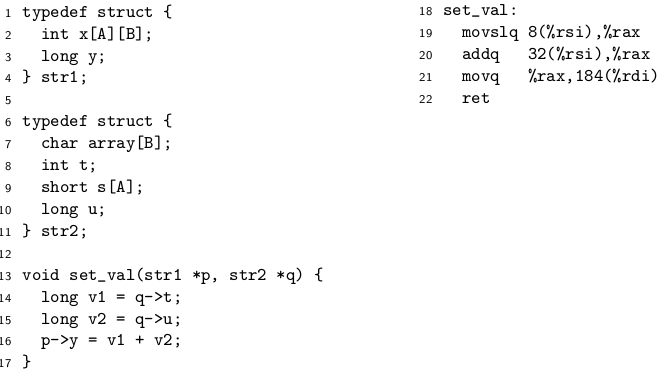
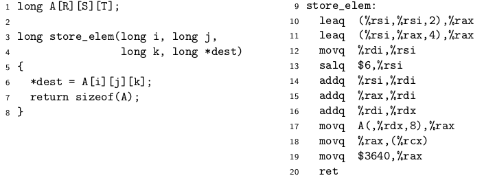
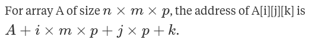
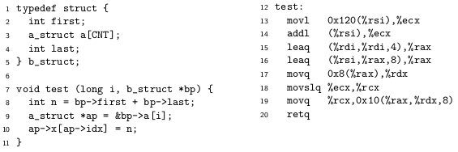

# Ask: Lista 6

## Zadanie 1

Wywnioskuj wartość A i B

zaczynamy od wnioskowania potencjalnie zajmowanych przez struktury miejsc,
a potem wybieramy takie A i B, żeby się zgadzało:

| Adres              | str2          |
| ------------------ | :-----------: |
| 0-__4__/5/6/7      | char array[B] |
| 8-11               | int t         |
| 12-25/27/__29__/31 | short s[A]    |
| 32                 | long u        |

| Adres         | str1        |
| ------------- | :---------: |
| 0-__179__/183 | int x[A][B] |
| 184           | long y      |

## Zadanie 2

R * S * T = 455. bo sizeof(A) = 3640

> &(A[i][j][k]) = 8 * (k + i + (i << 6) + 13j) + A = 8 * (65i + 13j + k) + A

A więc R = 7; S = 5; T = 13.

## Zadanie 3 ????

| Adres | b_struct        |
| ----- | :-------------: |
| 0-3     | int first       |
| 8-287     | a_struct a[7] |
| 288-293    | int last        |

| Adres | a_struct        |
| ----- | :-------------: |
| 0-7     | long idx       |
| 8-39     | long x[4] |

288+rsi -> ecx <- last  
ecx <- last + first  
40i + rsi -> %rax <- first + 40i  
8+rax -> rdx <- first + 40i + 8  
last + first -> rcx  
last + first -> 16 + first + 40i + (first + 40i + 8)*8  
